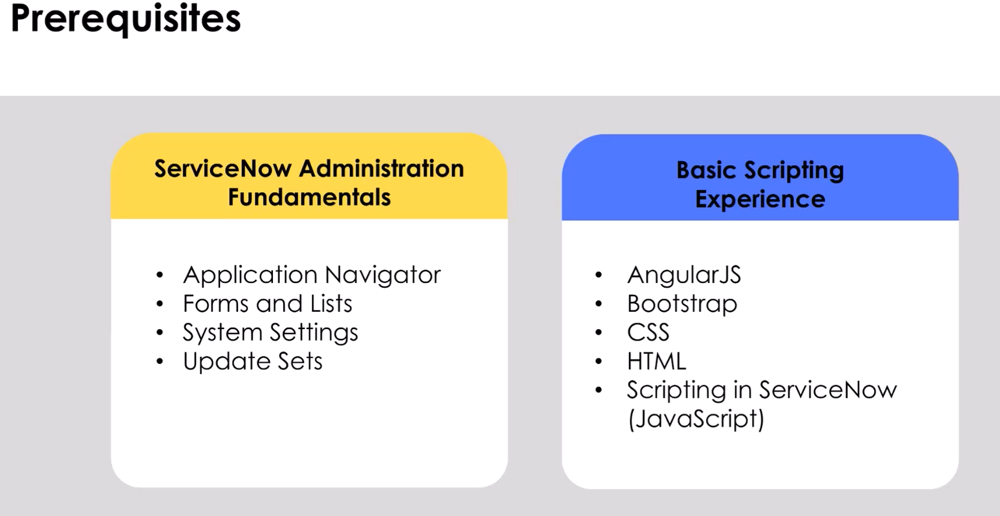
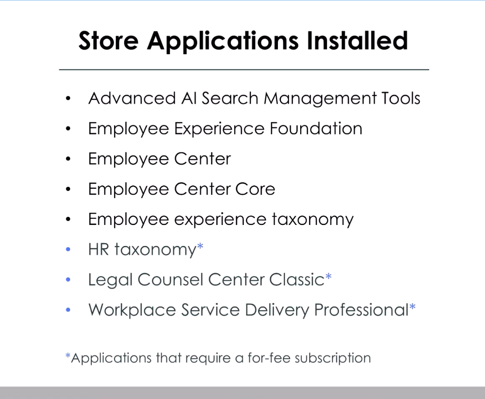
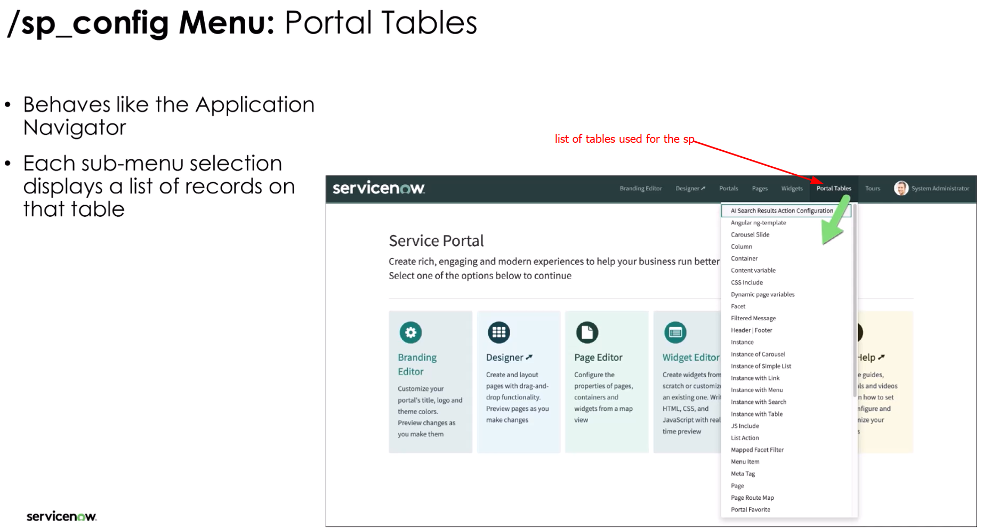
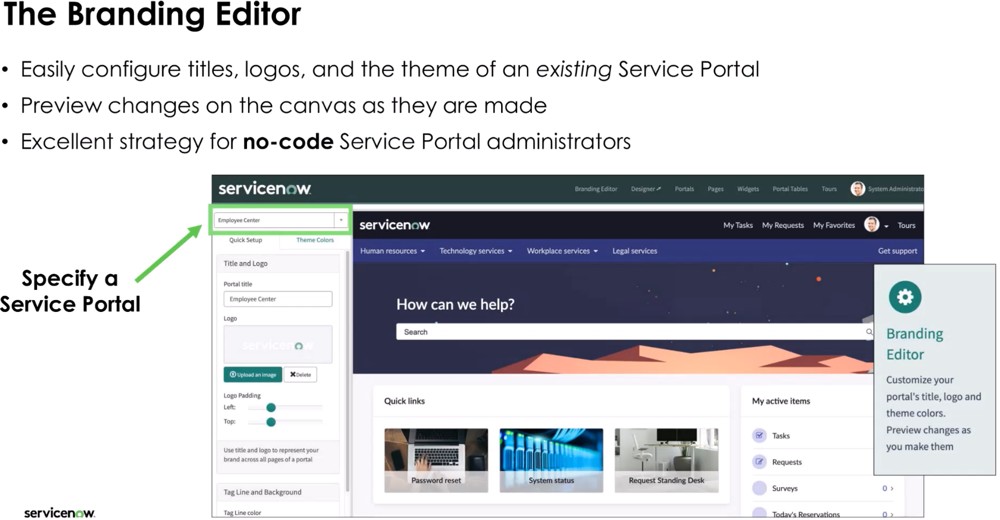

A Service Portal provides an alternative user experience to the standard platform interface. The Service Portal application offers the tools needed to configure, customize, and extend portal components to create an online experience similar to what your users are used to in other consumer products.

During this two day interactive training course students will:

Explore all aspects of the Service Portal application
Learn how to re‑configure an existing portal
Review the Service Portal framework
Discover the baseline Employee Center portal
Create new Service Portals, Themes, Pages, and Menus
Understand how to use and create Widgets
Re‑use existing Portal components
Explore using AI Search as the search engine in a Service Portal
Configure other aspects of the platform to enhance a Service Portal
Create a Guided Tour within a Service Portal
Discover the User Experience Analytics dashboard to better understand Service Portal usage metrics

MOdule1 

accessibility 

Next Service portal development and administration

SP roles

Administrators and developers

Delegated Development

go to system applications 

active in baseline 

service portal oob 

Portals baseline/oob 

service portal :application

key module to consider favoriting this is where all of the system config options for service portal is, btw the little arrow on the module lets you know that its going to open in another window or tab

The /sp_config homepage 

unsupported features in sp

next section Employee Center portal

employee center is the most recommended

Taxonomy refer to documentation

next section Service portal help and branding editor

Next Section branding editor

where are changes saved ?.. 

recap 

