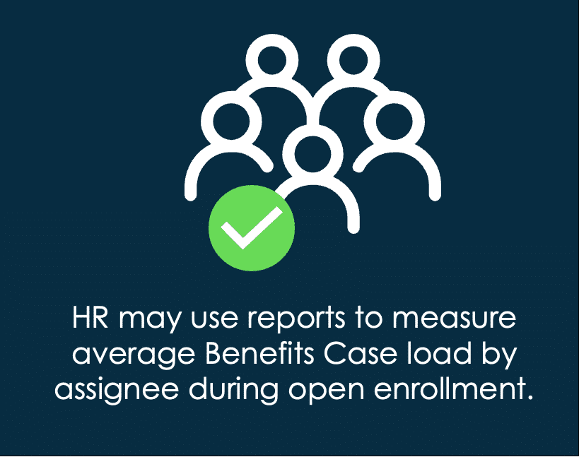
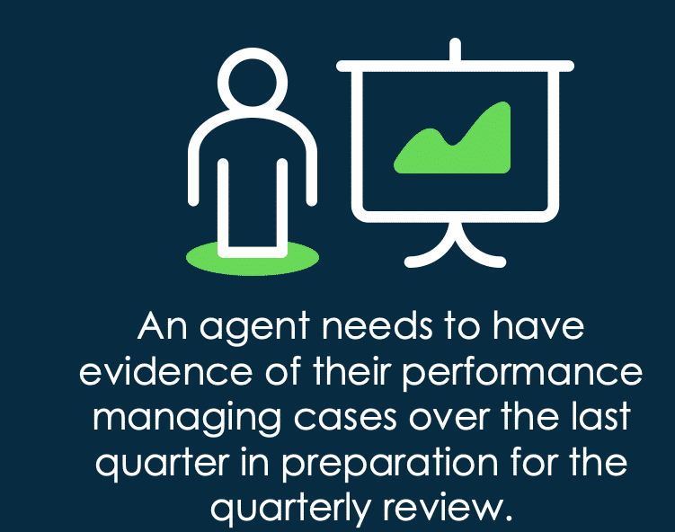
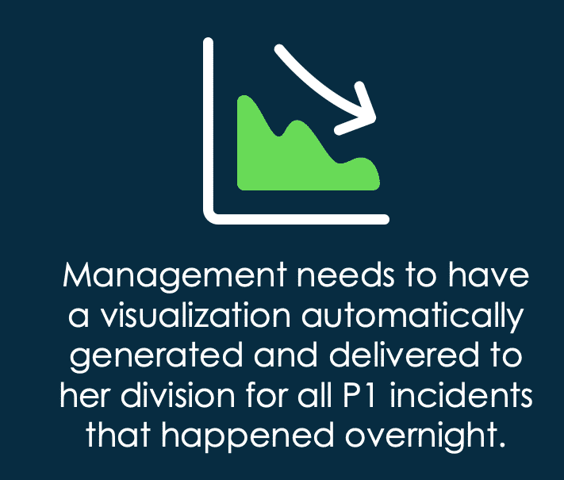
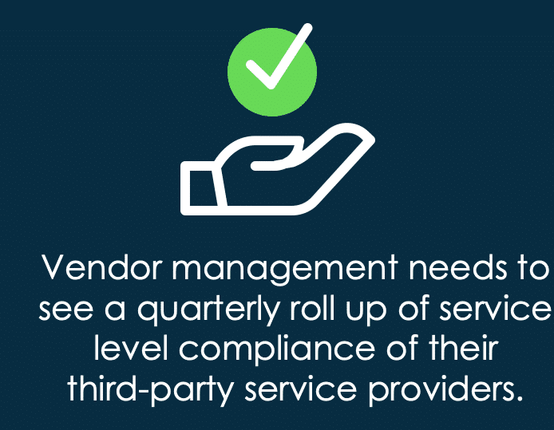
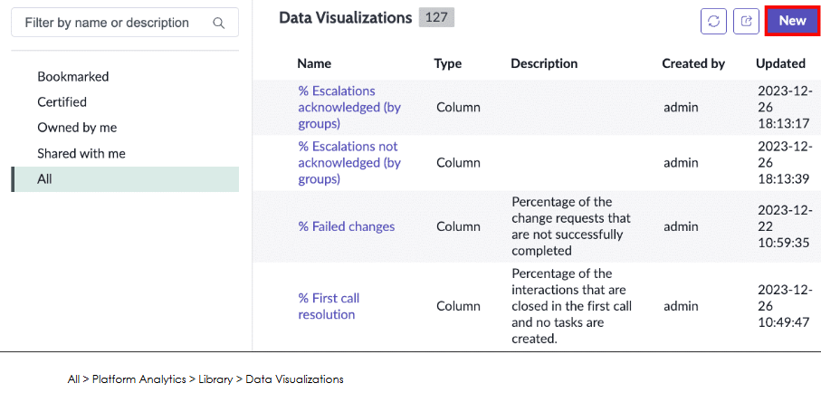
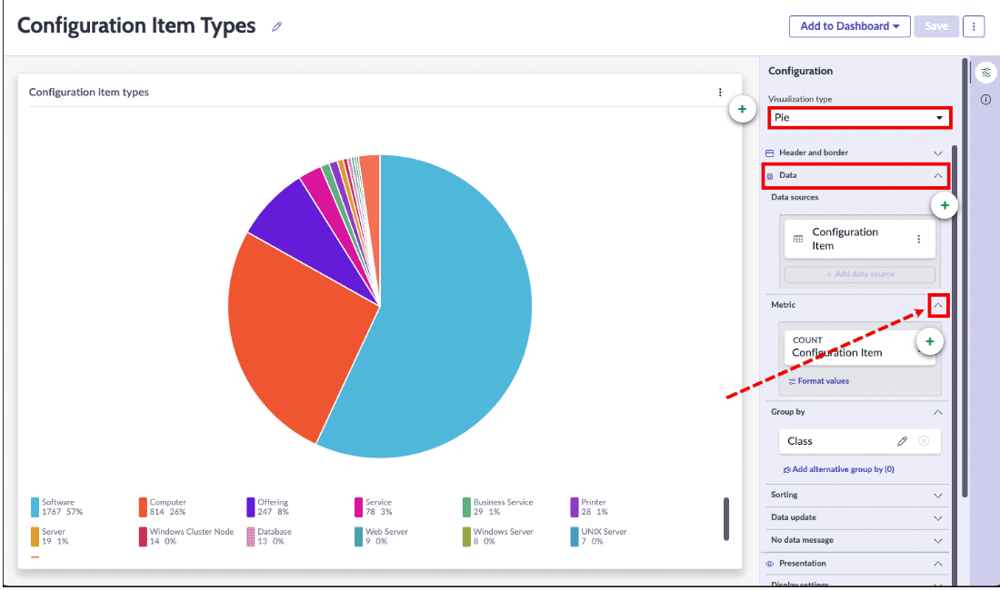

Platform Analytics in ServiceNow enables you to create, edit, and distribute data visualizations that show the current state of generated data in the Platform. With many options to choose from, you can visualize and filter your data using different types of charts and configurations. In this course you will: 

Familiarize yourself with the Visualization Designer interface

Add data sources and select different chart types

Create visualizations from a List view

Share and distribute visualizations

Create and populate dashboards

Learn about the advantages of the Visualization Designer and modifying existing charts

What is Platform Analytics?

ServiceNow data can be viewed and analyzed (in real-time or over time) by you and your colleagues. Data can be visually represented in many ways, including bar charts, pie charts, dials, lists, pivot tables, donuts, and more. 

Visualizations can be run manually or scheduled to run automatically. There are a range of predefined visualizations that pertain to applications and features like Incident Management and Service Catalog requests, including Key Performance Indicator (KPI) charts. 
You can create your own visualizations by navigating to All > Platform Analytics > Analytics Center module. From there, you may select Create new dashboard or Create New visualization. 

Types of visualizations
In the activity below, you will see how to access the Visualization Designer and see all the different types that are available to build your visualization. You may follow along in your instance by navigating to All > Platform Analytics > Analytics Center, then select Create new visualization.

Alternatively, you can navigate to All > Platform Analytics > Library > Data Visualizations, then select New (which is the path shown in the example below). 

ServiceNow Platform Analytics can easily answer questions such as: 

Did I meet an SLA?

How many incidents did my team close in a month?

(Metric reporting) What was the average time from Incident open to Incident closed for each Service Desk team?

Advantages of the Visualization Designer
In the next section, you will have the opportunity to explore the Visualization Designer in greater detail. Here are just a few advantages to using it! 

•
Leverage visibility and available visualization types

•
Use multi-level filters, filter operators, and sort order to refine data presentation

•
View, create, edit, and schedule visualizations

Data Visualization configurations

The Data Visualizations module contains a library of visualized data which you can run and use to create your own custom visualizations. Many of these visualizations came with the Platform and others can be created by your administrators specifically for your company. 

The Data Visualizations page contains different sections for visualizations which are visible to different audiences. Select each plus sign (+) below to learn more about each section.
