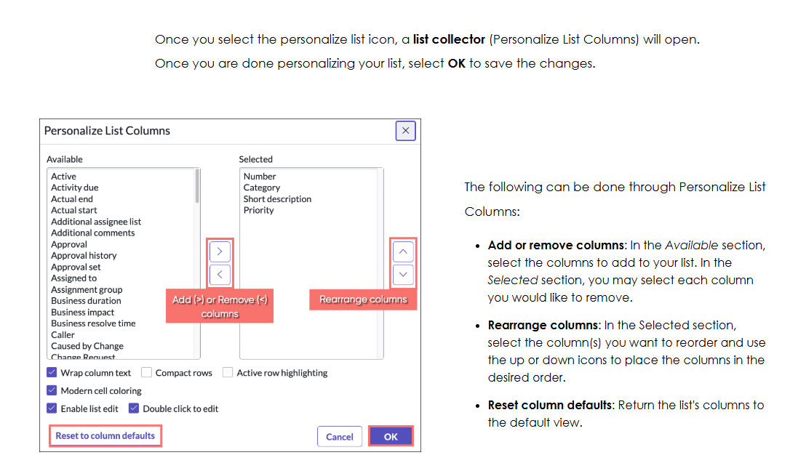

List views and personalizaion

 table data displayed as lists
 

 Additonal Actions on menus
 

 list controls 
 
 
 

 
 List views an sort control 
 

 List anatomy
 
 

 list personlization 
 
 

 Filters and tags
 

List Filters
filter - a set of conditons applied to a table list to isolate a subset of data
three components make up a filter conditon 

